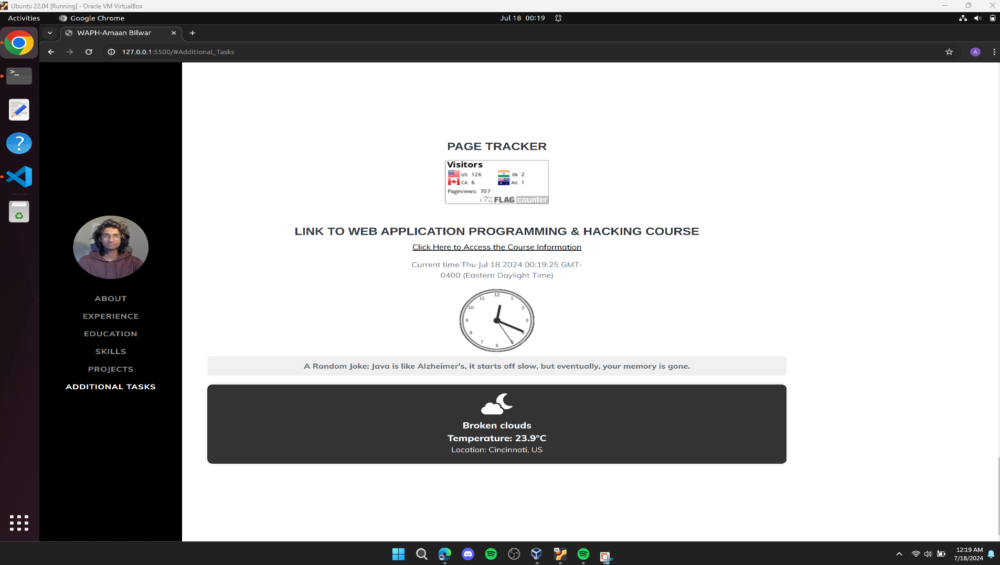
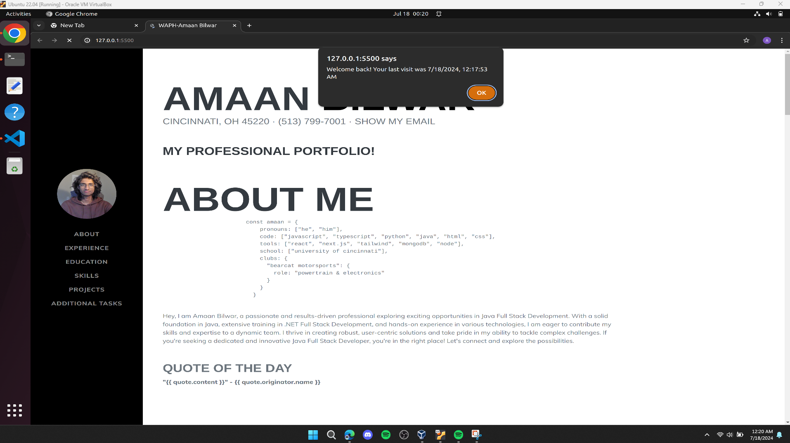

# WAPH-Web Application Programming and Hacking

## Instructor: Dr. Phu Phung

**Name**: Amaan Bilwar

**Email**: bilwarad@mail.uc.edu

**Short-bio**: Interested in backend software developement/devOps and enhancing cloud security


## Repository Information

Respository's URL: [https://github.com/amaan/amaanbilwar.github.io](https://github.com/amaanbilwar/amaanbilwar.github.io)

This is a private repository for Amaan Bilwar to store all code from the
course. 

# Individual Project 1
## Front-end Web Development with a Professional Profile Website on github.io cloud service

## Overview 

In this project we expand our knowledge of frontend development by building a project and using github pages to host the website for free. this website is a portfolio website that will be graded as a professional in the industy would do for hiring. There are three types of requirements to meet for this project. They are "general", "technical" and "non-technical". There are also additional tasks to be displayed on teh website which have to do with cookies and API integration.


Everything for this website has been pushed to the repository down below:

[https://github.com/amaanbilwar/amaan.github.io](https://github.com/amaanbilwar/amaanbilwar.github.io).


# General Requirements
like mentioned above, there is a public repository mentioned with name `amaanbilwar.github.io` to be hosted on github pages.  this website also contains a `waph.html` file to display the course information for Web Application Programming and Hacking. The `waph.html` website also contains links to all assignments completed throughout the course.
[https://amaanbilwar.github.io/waph.html](https://amaanbilwar.github.io/waph.html).


On top of that, the main file is `index.html` which contains all my information including experience, skill, projects, certificates etc. 
It is currently hosted at [https://amaanbilwar.github.io/](https://amaanbilwar.github.io/).


For easier and a more clean layout of the website we were recommended to use a template from Bootstrap and tailor it according to our preferences.


After all the personal information displayed as my resume on the website we incorporate all the additional tasks/requirements  for this project.


### Non-Technical Requirements

For the non-technical requirements:

1. Use Boot Strap Template
2. Include a flag counter which monitors page visits and logs the countries from which the page is viewed from.

### Technical Requirements

Regarding the technical criteria:

1. Usage jQuery and JavaScript code from Lab 2 to display a digital clock, an analog clock, and a toggle using onclick to  show/hide my email.
2. Usage of Vue.js(JavaScript Framework was also a technical requirement) and integration of a public API to fetch and display random quotes and the weather.


This is the API integration code written in JavaScript


1. **Joke API Integration:** Used a joke API from  [https://v2.jokeapi.dev/joke/Any](https://v2.jokeapi.dev/joke/Any) to display a random joke on the website. Jokes are timed at intervals every minute.

   ```javascript
   function getJoke() {
       $.get("https://v2.jokeapi.dev/joke/Any?type=single", function (result) {
           $("#response").html("A Random Joke: " + result.joke);
       });
   }
   setInterval(getJoke, 60000);
   getJoke();
   ```

2. **Weather API Integration:** Integrated the Weatherbit API from [https://www.weatherbit.io](https://www.weatherbit.io) to display current weather information. After obtaining an API key, the data is returned in JSON which I formatted and styled using CSS.

   


Additionally, as per the project requirements, we use cookies to remeber the user visit time and send out an alert. If the user is loading/accessing the website for the first time an alert message is sent out saying welcome and the cookies save the time each time the page is refreshed and show the last time the user was there with the current time and the time visited with a welcome back message. 



They were implemented as follows:


        new Vue({
            el: '#app',
            data: {
                quote: {
                    content: '',
                    originator: {
                        name: ''
                    }
                }
            },
            methods: {
                async fetchQuote() {
                    const options = {
                        method: 'GET',
                        url: 'https://random-quote-generator2.p.rapidapi.com/randomQuote',
                        headers: {
                            'X-RapidAPI-Key': 'b9b5a91c2emsh000a90d32a87145p1c5729jsne626d5f90d25',
                            'X-RapidAPI-Host': 'random-quote-generator2.p.rapidapi.com'
                        }
                    };
                    try {
                        const response = await axios.request(options);

                        if (Array.isArray(response.data) && response.data.length > 0) {
                            const quote = response.data[0];

                            this.quote.content = quote.Quote;
                            this.quote.originator.name = quote.Author;
                        } else {
                            console.error('Invalid data received from the API:', response.data);
                        }
                    } catch (error) {
                        console.error(error);
                    }
                }
            },
            created() {
                // Fetch a quote when the app is created
                this.fetchQuote();

                // Fetch a new quote every 12 hours
                setInterval(this.fetchQuote, 12 * 60 * 60 * 1000);
            }
        });

Code in HTML to display the Quote:

`<div class="mt-5">`
    ```<p>
    <h3 class="text-success">Quote of the day</h3>
    <strong>"{{ quote.content }}"</strong>
    <span style="font-weight: bold;"> - {{ quote.originator.name }}</span>
    </p>```
`</div>`


#### Html enitites added

html entities used to prevent the wwebsite against vulnerabilities.
1. `textContext` instead of `innerHTML` to prevent potential XSS vulnerabilities.
2. Used `encodeURIComponent` and `decodeURIComponent` methods for cookie values.
3. Corrected HTML entities for special characters like `'` and `"` in text.
4. Ensured that JavaScript template literals are corectly used for dynamic content.

